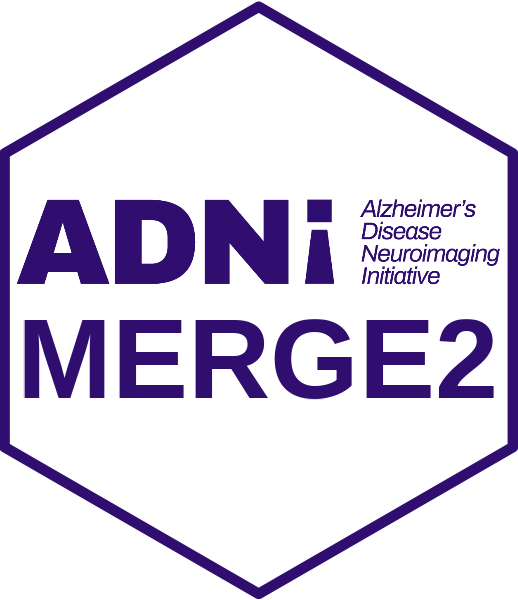

<!-- README.md is generated from README.Rmd. Please edit that file -->

<!-- R package versioning: first two digits are for code; last digit is data release number  -->

# ADNIMERGE2 

This is an R data package for the Alzheimer’s Disease Neuroimaging
Initiative (ADNI) study. All datasets are included as shared on
<https://adni.loni.usc.edu/>.

## Package Access

The ADNI study R data package, ADNIMERGE2, will be available on the data
sharing platform at [LONI website](https://adni.loni.usc.edu/). To
request access of the R package, it is required to submit an online
application via LONI website and acceptance of the ADNI Data Use
Agreement
[here](https://adni.loni.usc.edu/wp-content/uploads/how_to_apply/ADNI_Data_Use_Agreement.pdf).

## Installation

To install the package locally, run
`install.packages("path/to/ADNIMERGE2_0.1.1.tar.gz", repos = NULL, type = "source")`.

## Usage

Learn more about `ADNIMERGE2` at
[`Get Started`](https://atri-biostats.github.io/ADNIMERGE2/articles/ADNIMERGE2.html) page
