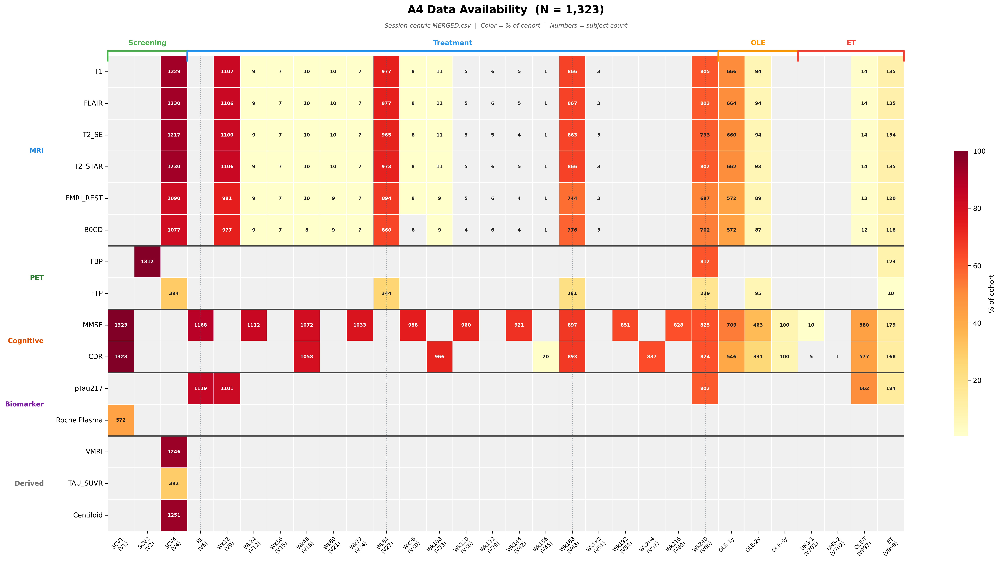
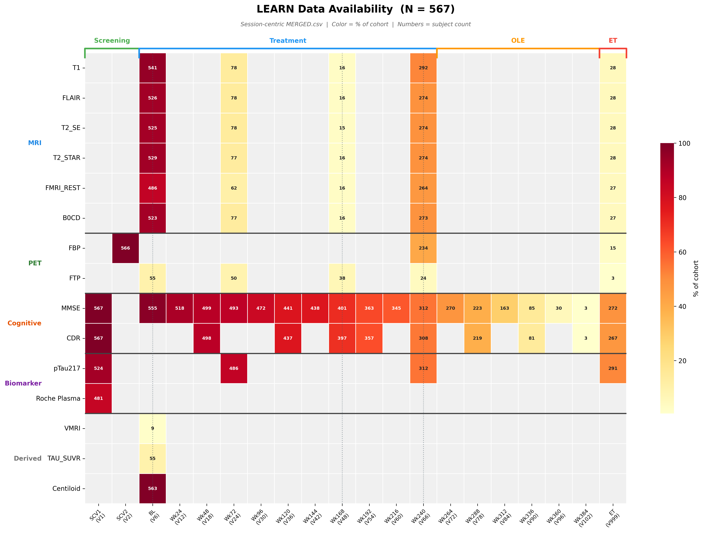

# A4/LEARN Pipeline

A4 Study와 LEARN 관찰연구의 clinical + NII 영상 데이터를 통합하는 파이프라인.

---

## A4 데이터를 처음 쓴다면

### 1단계: 연구 배경 이해

A4 (Anti-Amyloid Treatment in Asymptomatic Alzheimer's)는 인지적으로 정상이지만
뇌 아밀로이드가 축적된 고령자를 대상으로 한 Phase 3 임상시험입니다 (Solanezumab, Eli Lilly).
LEARN은 아밀로이드 음성 대조군의 관찰 연구입니다.

| 코호트 | N | 아밀로이드 | 영상 |
|--------|---|-----------|------|
| **amyloidE** (A4 Trial) | 1,323 | 양성 (SUVr >= 1.15) | PET + MRI + Tau PET 서브셋 |
| **LEARN amyloidNE** | 567 | 음성 | PET + MRI |
| **amyloidNE** (screen fail) | 2,596 | 음성 | PET만 (MRI 없음) |

> screening fail(amyloidNE)은 기본적으로 출력에서 제외됩니다.
> 포함하려면 `a4-pipeline --include-screen-fail`을 사용하세요.

프로토콜 상세: [`docs/A4_protocol.md`](../../docs/A4_protocol.md)

#### Baseline 정의 (중요)

A4는 ADNI와 달리 screening부터 randomization까지 **여러 방문(V1~V6)에 걸쳐 baseline 데이터가 수집**됩니다.
우리 파이프라인에서는 이 V1~V6을 하나의 **"Baseline"** 시점으로 통합하여 사용합니다.

```
V1 (screening)  → CDR, 혈액 바이오마커 (pTau217, Roche panel)
V2 (PET scan)   → Amyloid PET (FBP), 아밀로이드 적격성 판정
V4 (MRI)        → T1, FLAIR, Tau PET (FTP), MRI 볼륨 (VMRI 50 ROI)
V6 (randomization) → MMSE, 최종 등록 확정
```

`BASELINE.csv`는 이 모든 시점의 데이터를 **피험자당 1행**으로 통합한 것입니다.
따라서 BASELINE.csv의 한 행에는 V1의 CDR, V2의 PET, V4의 MRI, V6의 MMSE가 함께 들어있습니다.

> LEARN은 V4가 아닌 **V6에서 MRI가 촬영**됩니다. 이 차이는 파이프라인에서 자동 처리됩니다.

### 2단계: 출력 CSV 선택

파이프라인이 생성하는 CSV 중 연구 목적에 맞는 것을 골라 쓰세요.

| 파일 | 언제 쓰나요? | 행 단위 | 규모 |
|------|-------------|---------|------|
| **`BASELINE.csv`** | cross-sectional 분석, 코호트 기술통계 | **피험자당 1행** (BID) | ~1,890행 |
| **`MERGED.csv`** | 전체 세션 longitudinal 분석 | 세션당 1행 (BID x SESSION_CODE) | ~89K행 |
| **`MMSE_longitudinal.csv`** | MMSE 시계열 분석 | 측정당 1행 | ~26K행 |
| **`CDR_longitudinal.csv`** | CDR 시계열 분석 | 측정당 1행 | ~15K행 |
| **`imaging_availability.csv`** | 세션별 영상 보유 현황 확인 | 세션당 1행 | ~11K행 |

> **처음이라면 `BASELINE.csv`부터 시작하세요.**
> 피험자당 1행으로 demographics, 아밀로이드 PET, MRI 볼륨, 인지검사, 혈액 바이오마커가 모두 들어있습니다.

#### ADNI MERGED.csv와의 차이 (중요)

A4의 `MERGED.csv`는 ADNI의 `MERGED.csv`와 **성격이 다릅니다**.

| | ADNI MERGED.csv | A4 MERGED.csv |
|---|---|---|
| 행 기준 | **영상 촬영일** 기준 — 해당 시점의 임상 데이터를 매칭 | **SV.csv 전체 세션** 기준 — 영상 없는 세션도 포함 |
| 임상+영상 관계 | 같은 행에 같은 시점의 영상과 임상이 매칭됨 | 임상과 영상이 **다른 세션**에 있을 수 있음 |
| 주 용도 | 그 자체로 분석에 바로 사용 | 세션 마스터 인덱스, 개별 CSV와 조합하여 사용 |

**왜 다른가?** A4는 임상 평가(MMSE, CDR)와 영상 촬영(MRI, PET)이 **서로 다른 방문**에서
이루어지는 경우가 많습니다. 예를 들어 MMSE는 V6에서, MRI는 V4에서, PET은 V2에서 촬영됩니다.
ADNI처럼 "이 영상에 대응하는 임상 데이터"를 행 단위로 1:1 매칭하는 것이 구조적으로 맞지 않아서,
우리 파이프라인에서는 이 매칭을 수행하지 않았습니다.

**따라서 연구 시 권장하는 방법:**

1. **Cross-sectional 분석** → `BASELINE.csv` 사용 (V1~V6 통합, 피험자당 1행)
2. **Longitudinal 인지 변화** → `MMSE_longitudinal.csv` 또는 `CDR_longitudinal.csv` 사용
3. **영상 보유 현황 확인** → `imaging_availability.csv`로 어떤 피험자가 어떤 시점에 어떤 영상을 가졌는지 확인
4. **영상 + 임상 조합 분석** → `BASELINE.csv`의 임상 데이터 + `{MOD}_unique.csv`의 NII 경로를 BID로 직접 조인

> `MERGED.csv`는 전체 세션의 마스터 인덱스로서, 세션별 DAYS_CONSENT, PTAGE, MODALITIES 등을
> 확인하는 데 유용합니다. 하지만 **분석의 시작점은 `BASELINE.csv`**입니다.

### 3단계: 참고 문서 읽기

| 문서 | 내용 | 언제 읽나요? |
|------|------|-------------|
| [`docs/A4_protocol.md`](../../docs/A4_protocol.md) | 연구 프로토콜, 코호트 구조, 방문 체계 (V1~V9), 영상/바이오마커 | A4 데이터 구조를 처음 접할 때 |
| [`docs/A4_column_dictionary.md`](../../docs/A4_column_dictionary.md) | MERGED.csv 출력 컬럼 사전 (~400개) | 특정 컬럼의 의미를 찾을 때 |
| [`docs/A4_viscode_reference.md`](../../docs/A4_viscode_reference.md) | VISCODE <-> SESSION_CODE 전체 매핑 (152개) | SESSION_CODE가 어떤 방문인지 알고 싶을 때 |
| [`docs/A4_data_catalog.md`](../../docs/A4_data_catalog.md) | NFS 원본 파일 카탈로그 (93 CSV + 20 PDF) | 소스 데이터 위치를 찾을 때 |
| [`docs/A4_join_relationships.md`](../../docs/A4_join_relationships.md) | 파일 간 조인 키, 관계도 | 파이프라인 로직을 이해하고 싶을 때 |
| [`docs/A4_csv_profiles.md`](../../docs/A4_csv_profiles.md) | 컬럼 프로파일 (타입, null률, 값 범위) | 데이터 품질을 확인할 때 |

---

## Data Availability

### A4 (N = 1,323)



### LEARN (N = 567)



> Color = % of cohort | Numbers = subject count
> Session-centric MERGED.csv 기준. Screening fail (amyloidNE) 제외.

---

## BASELINE.csv 상세

위의 [Baseline 정의](#baseline-정의-중요)에서 설명한 대로, V1~V6의 데이터를 피험자당 1행으로 통합한 CSV입니다.

| 컬럼 그룹 | 예시 | 소스 시점 | Fill |
|-----------|------|-----------|------|
| Demographics (7열) | PTGENDER, PTAGE, PTEDUCAT, APOEGN | screening | ~100% |
| Amyloid PET (4열) | AMY_STATUS_bl, AMY_SUVR_bl, AMY_CENTILOID_bl | V2 | ~100% |
| Cognitive (3열) | MMSE (V6), CDGLOBAL/CDRSB (V1) | V6/V1 | 91~100% |
| pTau217 (14열) | PTAU217_BL, PTAU217_WK12, *_LLOQ | screening | 10~57% |
| Roche Plasma (12열) | ROCHE_GFAP_bl, ROCHE_NFL_bl, *_BLQ | screening | 24~56% |
| NII Paths (4열) | T1_NII_PATH, FBP_NII_PATH, FTP_NII_PATH | V2/V4 | 24~99% |
| VMRI (51열) | VMRI_LeftHippocampus_bl 등 50 ROI | V4 | 66% |
| TAU SUVR (273열) | TAU_Mean_Left_Hippocampus_bl 등 273 ROI | V4 | 24% |

컬럼별 상세 정의, 값 범위, 알려진 제한 사항(PTAGE 누락, CDR 소스 시점 등)은
[`docs/A4_baseline_csv.md`](../../docs/A4_baseline_csv.md)를 참조하세요.

---

## imaging_availability.csv 사용법

어떤 피험자가 어떤 시점에 어떤 영상을 보유하는지 한눈에 파악할 수 있습니다.

| BID | SESSION_CODE | DAYS_CONSENT | T1 | FLAIR | FBP | FTP | ... |
|-----|-------------|-------------|----|----|----|----|-----|
| B10081264 | 002 | 0 | 0 | 0 | 1 | 0 | ... |
| B10081264 | 004 | 14 | 1 | 1 | 0 | 1 | ... |
| B10081264 | 027 | 365 | 1 | 1 | 0 | 0 | ... |

- `1` = 해당 세션에 NII 파일 존재, `0` = 없음
- `DAYS_CONSENT` = 동의일(consent) 기준 경과 일수

---

## 모듈 구조

| 모듈 | 역할 |
|------|------|
| `config.py` | NFS 경로, 모달리티 정의, JSON sidecar 필드맵, 임상 CSV 파일 매핑 |
| `inventory.py` | NII 폴더 스캔 -> JSON inventory (BID/session/modality 구조) |
| `clinical.py` | 51+ 임상 CSV -> 통합 DataFrame (demographics, cognitive, amyloid, VMRI, Tau, pTau217, Roche plasma) |
| `pipeline.py` | 모달리티별 매칭 + merge + BASELINE/longitudinal/imaging_availability CSV 생성 |
| `cli.py` | CLI 엔트리포인트 (`a4-pipeline`) |

---

## CLI 사용법

```bash
# 전체 파이프라인 (추천)
a4-pipeline

# 개별 단계만 재생성
a4-pipeline --baseline-only           # BASELINE.csv만
a4-pipeline --longitudinal-only       # MMSE/CDR longitudinal + imaging availability
a4-pipeline --merge-only              # MERGED.csv만
a4-pipeline --inventory-only          # NII inventory만
a4-pipeline --clinical-only           # 임상 테이블만

# 옵션
a4-pipeline --modality T1,FBP         # 특정 모달리티만
a4-pipeline --include-screen-fail     # amyloidNE (스크리닝 탈락) 포함
a4-pipeline --overwrite               # 기존 결과 덮어쓰기
a4-pipeline --build-inventory         # NII inventory 강제 재생성
```

각 명령어에 `--help`를 붙이면 전체 옵션을 확인할 수 있습니다.

---

## NFS 출력 디렉토리

```
A4/ORIG/DEMO/matching/
├── BASELINE.csv                     피험자당 1행 baseline (~1,890행 x 371열)
├── MERGED.csv                       전체 세션 통합 (~89K행)
├── MMSE_longitudinal.csv            MMSE 시계열 (~26K행)
├── CDR_longitudinal.csv             CDR 시계열 (~15K행)
├── imaging_availability.csv         영상 보유 현황 (~11K행)
├── clinical_table.csv               통합 임상 테이블 (중간 산출물)
├── nii_inventory.json               NII 인벤토리
├── a4_pipeline.log
└── unique/                          모달리티별 매칭 결과
    ├── T1_unique.csv
    ├── FBP_unique.csv
    └── ...
```

---

## 지원 모달리티

| 모달리티 | 타입 | NFS 폴더명 | 설명 |
|----------|------|-----------|------|
| T1 | MR | T1 | 구조 MRI |
| FLAIR | MR | FLAIR | FLAIR MRI |
| T2_SE | MR | T2_SE | T2 spin echo |
| T2_STAR | MR | T2_star | T2* GRE |
| FMRI_REST | MR | fMRI_rest | 안정 상태 fMRI |
| B0CD | MR | b0CD | B0 field map |
| FBP | PET | FBP | Florbetapir (amyloid) |
| FTP | PET | FTP | Flortaucipir (tau) |

---

## ADNI와의 차이

A4에 처음 접근하는 ADNI 경험자를 위한 참고:

| 항목 | ADNI | A4/LEARN |
|------|------|----------|
| 영상 포맷 | DICOM | **NIfTI** (+ JSON sidecar) |
| 매칭 방식 | EXAMDATE 날짜 매칭 (+-180d) | **session_code 직접 조인** (날짜 매칭 불필요) |
| 피험자 ID | PTID (XXX_S_XXXX) | **BID (B + 8자리)** |
| 날짜 | 절대 날짜 (YYYY-MM-DD) | **비식별화** (연도만, 경과 일수 사용) |
| 임상 데이터 | ADNIMERGE.rda 통합 | **51+ 개별 CSV** |
| 진단 | CN / MCI / Dementia (방문별) | amyloidE / LEARN amyloidNE (고정) |
